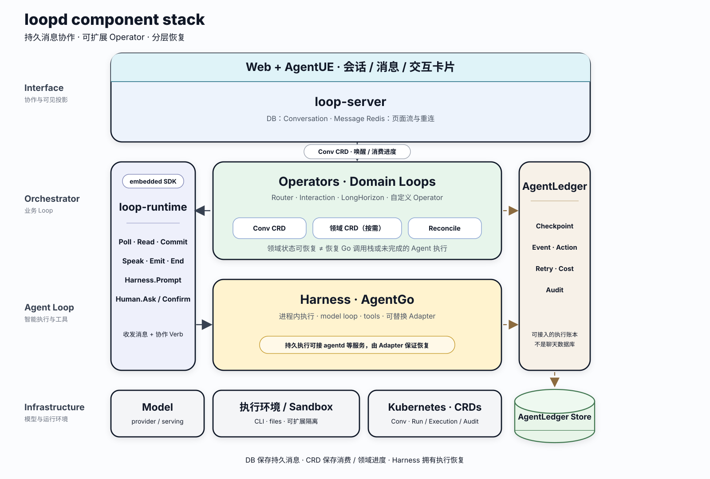

# loopd

**English** | [简体中文](README.zh-CN.md)

`loopd` is an orchestration runtime for collaboration among humans, Harnesses,
and Kubernetes Operators.

Its guiding idea is:

```text
Loop = Resource(spec + status) + Reconcile
```

Every chat request creates a small loopd Task CRD that wakes the selected
Actor. A simple Operator can reconcile that Task directly; a complex
Operator may create domain CRDs for its own state and completion semantics.
`loopd` keeps visible collaboration in conversations and messages. A Harness
owns its execution state, while AgentLedger records the complete execution
history.


## Components

- **loop-server** owns page-visible conversations and messages. It pairs each
  active chat request with a Task CRD so the work can outlive an HTTP request,
  browser connection, or server process.
- **loop-runtime** is a Go toolkit for building Operators. It combines
  controller-runtime resource reconciliation with loopd collaboration capabilities.
  See the [runtime design](docs/runtime.md) for the Operator development contract.
- **Harness adapters** let an Operator invoke agentd or another intelligent
  execution service through loop-runtime without leaking provider vocabulary
  into the public model. The bundled AgentGo adapter is an in-process demo;
  production durability belongs to agentd.

AgentUE supplies the page-visible event model and Redis bridge. AgentLedger
records complete prompts, model events, tool calls, retries, and costs; it is
not the chat database. Hostel provides the agent-native sandbox for file,
tool, and compute execution.

The public conversation roles are always:

```text
user | harness | operator
```

## Runtime stack

This component view shows the ownership and runtime boundaries behind that
collaboration model. loop-runtime is embedded in an Operator, while
AgentLedger preserves execution facts across orchestration and Agent
execution.



## Long-running execution

A question may run for minutes or days. Users can disconnect and return to the
same conversation to follow its progress and read the answer. The selected
Operator or Harness owns the work behind that answer, and an Operator can call
multiple Harnesses before publishing its result.

Recovery depends on the execution and storage configuration. The bundled
AgentGo demo runs in process; durable execution across Operator restarts requires
a persistent Harness adapter. See the [runtime design](docs/runtime.md) for the
calling and recovery contract, and [Kubernetes deployment](deploy/k8s/README.md)
for the storage and Quick Start limits.
