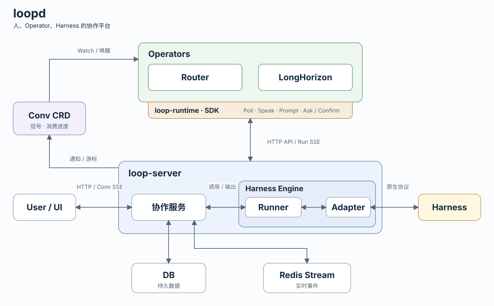

# loopd

`loopd` is an orchestration runtime for collaboration among humans, Harnesses,
and Kubernetes Operators.

Its guiding idea is:

```text
Loop = Resource(spec + status) + Reconcile
```

Every chat request creates a small loopd Task CRD that wakes the selected
Actor. A simple Operator can reconcile that Task directly; a complex
Operator may create domain CRDs for its own state and completion semantics.
`loopd` keeps visible collaboration in conversations and messages, while full
execution history belongs to the Harness and AgentLedger.



## Components

- **loop-server** is a Hertz service that owns page-visible conversations and
  messages. Before committing a chat request, it also creates the Task CRD;
  failure rolls the messages back.
- **loop-runtime** is a Go client embedded in an Operator. It exposes stable
  conversation and message capabilities through `r.Loop.Chat`, and lets a
  Reconciler watch and resolve Tasks through `r.Loop.Task`.
- **Harness adapters** let an Operator invoke agentd or another intelligent
  execution service through loop-runtime without leaking provider vocabulary
  into the public model. The bundled AgentGo adapter is an in-process demo;
  production durability belongs to agentd.

AgentUE supplies the page-visible event model and Redis bridge. AgentLedger records complete
prompts, model events, tool calls, retries, and costs; it is not the chat database.

The public conversation roles are always:

```text
user | harness | operator
```

## Long-running execution

A question may run for minutes or days. Its lifecycle is independent from any
HTTP request or browser connection:

1. loop-server creates a user message and an empty target response message with one
   `task_id`, initializes its AgentUE stream, then creates a same-ID Task CRD before committing the messages;
2. the selected Operator or Harness watches the Task and resolves its current
   input and conversation history through loop-runtime;
3. a complex Operator may create a domain CRD, while a simple Operator handles
   the shared Task directly;
4. visible progress flows through the AgentUE Redis event bridge while full events enter AgentLedger;
5. clients may reconnect to any server instance with the same `task_id` and continue from their last event ID;
6. completion folds visible events into the selected Actor's response Message,
   marks the stream terminal, and removes the Task marker.

`Harness.Prompt` returns a handle. A Reconciler can consume its stream while
doing other work, or call `Wait` when the Harness result is the only remaining
dependency. Repeated calls use the same `(task ID, effect key)`; the AgentGo
demo reuses the Call for the lifetime of one runtime, while a production agentd
adapter must make that identity durable across Operator restarts.
