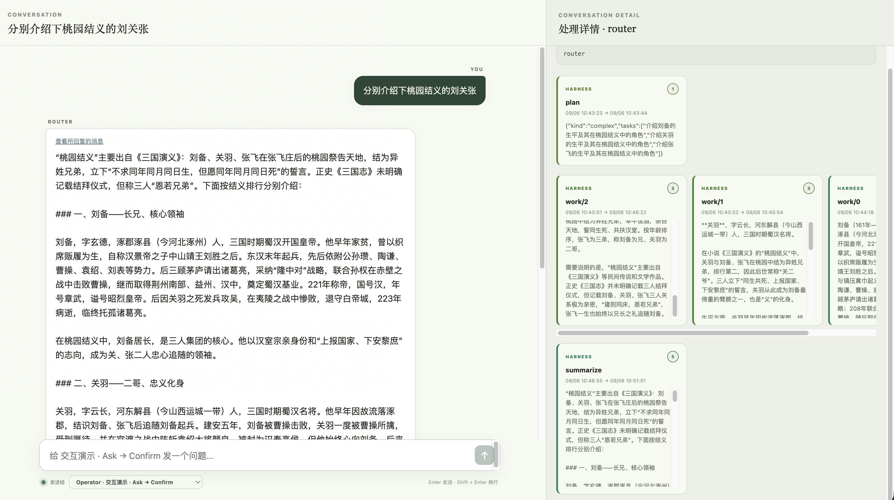

# loopd

[English](README.md) | **简体中文**

`loopd` 是一个 Agent 编排的服务端运行时。开发者通过 Kubernetes Operator，
将人、Agent 执行服务（Harness）与业务系统组织在一起，从问题路由到长期任务都可以按需编排。

## 理念

Agent 负责执行工作，业务仍需要定义目标、组织参与者，并判断结果是否达标。
loopd 提供一套公共运行时，让开发者用普通代码表达这些判断：

```text
Loop = Resource(spec + status) + Reconcile
```

Resource 保存目标与观测状态，Reconcile 决定下一步。
每个 Operator 自行定义工作流、角色与完成条件。

## 特色

- **用代码开发自己的编排。** 将 Agent 判断与确定性代码、业务 API 组合起来。
  Go 开发库 loop-runtime 提供调用 Harness、向人提问、发布进展等公共能力。
- **工作进行中持续协作。** 人、Operator 与 Harness 通过持久消息交流。
  用户可以随时补充信息，Operator 按需发布阶段结果或请求确认。
- **长期工作有状态、可观察。** Conversation 呈现共享进展与结果，领域 Resource 保存业务状态，
  Operator 可以跨时间组织规划、执行与验证。


## 演示

内置 Router 为问题制定计划，并行调用 Harness，再汇总回答。
下图中，它分别介绍刘备、关羽、张飞，右侧处理详情展示回答背后的规划、执行与汇总过程。



[LongHorizon Operator](operators/longhorizon/README.md) 展示更长的闭环：
Manager 规划 CLI 工作，Executor 执行，Auditor 检查工件，再决定下一步。

## 快速开始

按照 [Kubernetes Quick Start](deploy/k8s/README.md) 安装 server、Router 与 Web UI，
配置 OpenAI-compatible 模型地址和凭据，打开页面后选择 Router 并提交问题。

Quick Start 使用临时存储与进程内 AgentGo Demo。跨重启恢复需要持久存储、Operator
领域进度与持久 Harness Adapter，具体见 [恢复契约](docs/runtime.md#harness-执行与恢复)。

开发 Operator 可从 [Router 源码](operators/router/internal/router/router.go) 和
[Runtime 指南](docs/runtime.md) 开始；更多设计见 [Kernel](docs/kernel.md)、
[组件栈](docs/stack_v1.svg) 与 [镜像构建](deploy/docker/README.md)。
