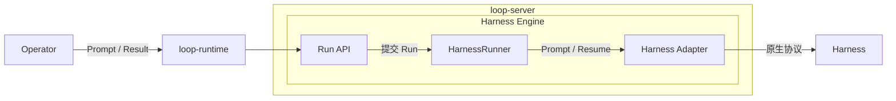

# Harness Engine：管理与运行

Harness Engine 是 Server 内提供 Harness 调用与执行管理的整体能力：Run 保存调用事实，
Runner 驱动生命周期，Adapter 适配不同 Harness。Harness 自身拥有智能执行状态。
本文集中描述 Harness 的管理、运行、输出和恢复；Operator 如何组合调用见 [Runtime](runtime.md)，
跨参与者的协作边界见 [Kernel](kernel.md)。

## 概念与职责

| 概念 | 责任 |
|---|---|
| Harness Engine | Server 内的调用与执行管理能力，涵盖 Run、Runner 和 Adapter 的协作 |
| Harness | 拥有原生执行状态、上下文和恢复能力；可以是进程内执行库或远端服务 |
| Adapter | 适配原生启动、观察与恢复协议，将可见过程转换为 AgentUE，提取最终 text/JSON |
| Harness Run | Server 持久保存的一次调用，关联请求、执行引用、输出 Message 和调用终态 |
| HarnessRunner | Server 内的后台组件，驱动 Run：领取、调用 Adapter、固化输出、恢复及收尾 |
| runtime Call | Operator 持有的远程句柄，通过 Server API 观察、取结果或请求取消 Run |

Run 保存驱动所需的事实，Runner 执行驱动逻辑；Adapter 负责 Harness 差异。Runner 不解释原生
协议，Adapter 不直接写 loopd DB 或 Redis。Harness 内部状态由执行端持有，Operator 的业务
状态由自己的领域 CRD 持有；Harness Run 与 LongHorizon 的业务 Run 是不同对象。

Engine 是这组能力的架构名称。实现分别落在 Server 的 Run API、service/repo、
`component.HarnessRunner` 和 `pkg/harness`；代码沿用这些具体职责名称，无需独立 Engine 进程或包装层。



## 管理：配置、注册与身份

### 可执行目标由部署配置

Server 按 target key 装配 Adapter；Prompt 的 Target 从这份配置中选择，未配置的 target 会被
拒绝。连接地址、模型、凭据和工具权限由部署提供，运行中的调用只引用 target，不提交凭据。
Server 启动时加载配置，详细配置入口见本文的 [配置与验证](#配置与验证)。

同一 Adapter 类型可以配置多个 target，分别使用不同模型或执行环境。承担同一组调用接管的
Server 副本需要一致的 target 配置和输出投影版本，才能按原调用身份恢复。

### 在线注册用于发现

Harness.Register 按 kind/key 登记展示名称、描述和在线租约，并随 runtime 生命周期续租。
Server 的 actors 接口只列未过期的注册；停止续租后退出在线列表。注册表示可发现的身份，
不验证原生服务健康、不装配 Adapter，也不自动创建 Harness Run。

内部 Harness 可以仅作为配置 target 被 Operator 调用，无需注册成用户可选的 Actor。反之，
有注册记录也不代表同名 target 已配置。注册租约决定发现可见性，Run 的执行租约决定驱动归属；
注册到期不会取消已经接收的 Run。通用注册 Verb 用法见 [Runtime](runtime.md#注册与发现)。

### 执行目标与发言身份分开

Target 选择实际 Adapter，Actor kind/key 表示输出 Message 的作者；未指定 Actor 时使用
kind=harness、key=target。Operator 可以指定自己的角色身份，例如 LongHorizon 的 Manager，
而多个角色复用同一执行 target。自定义 ActorKind 是开放字符串，不要求先注册才能发言。

输出归属请求指定的 Conversation。Operator 通常将协作过程放入自己的工作会话，再向主会话
Speak 总结；会话组织不改变 Harness 的执行协议或生命周期。

## Adapter：适配原生执行

公共接口位于 [pkg/harness](../pkg/harness/harness.go)。Adapter.Prompt 启动调用并及时返回
Harness 侧的 Call；该句柄提供过程事件和最终结果。它与 runtime Call 分处 Server 两侧：
前者封装原生执行，后者只观察 Server 中的持久 Run。

Adapter 同时满足两种消费需求：

- 面向页面：将原生可见过程转换为 AgentUE set/append，由 Runner 写入输出 Message。
- 面向 Operator：从原生最终响应提取 text 或 JSON，由 Runner 保存为 result block。

loopd 不要求 Harness 原生返回 AgentUE，也不从过程文本的最后一段猜测最终结果。原生 Session
等执行引用可通过 ExecutionReference 暴露，Runner 将其作为不透明数据保存，恢复时交还 Adapter。
支持接管的 Adapter 实现 Recoverable.Resume，保证挂接同一次执行和稳定回放；无法保证时明确
报告不支持恢复。具体回放与观察故障处理见 [恢复与内存](#恢复与内存)。

### HTTP 连接管理

HTTP Adapter 可复用 `pkg/harness/internal/httpclient`：每个 Adapter 实例持有一个 Client，
内部为短请求和流式请求分别维护独立的连接池，通过 DoShort、DoStream 选择。Managed Agent
的 Session 创建与历史查询走短请求池，SSE 走流式请求池，避免长连接占满后阻塞历史补读。
MaxConnections 是每个 host、每个池的连接上限，与 Engine 的 Run 并发额度分别配置。

HTTPTimeout 限制短请求全过程（含响应体），也限制两类连接的建立与响应头等待；流式响应体
的生命周期由请求 context 控制，Managed Agent 另外使用 StreamTimeout 限制观察时长。
连接池随 Adapter 复用，响应体由调用方关闭；CloseIdleConnections 释放两个池的空闲连接，
不打断活跃调用。鉴权、协议、重试与恢复策略仍归 Adapter。

## Run：提交、驱动与观察

一次调用的主流程是：

1. Operator 通过 runtime 提交调用，Server 检查幂等身份和容量，原子保存 Run 与输出 Message。
2. API 返回 Run 身份；后台 Runner 领取执行租约，通过 Adapter 启动或恢复 Harness。
3. Adapter 提供过程事件，Runner 合并到 DB 快照，再将实时事件 append-only 写入 Redis。
4. Harness 返回最终结果或错误，Runner 保存 result 或 error 及终态，UI 和 Operator 各自观察。

调用一旦接收，运行生命周期由 Server 驱动，Operator 或 UI 的连接不持有它。业务何时重试、
兜底、报告错误或 Commit 仍由 Operator 决定。

### 提交与观察

`POST /v1/harness/runs` 接收 conversation_id、idempotency_key、effect_key、target、text、
可选 tools、actor、recipient、meta 和 timeout。Go SDK 的 timeout 使用 time.Duration JSON 数值
（纳秒），省略时为 30 分钟。actor 默认是 harness/target；自定义角色使用开放 kind/key。

接收事务创建 harness_runs 和独立的输出 Message，提交后返回 202 与 Call（id、message_id、
phase、deadline_at 等），无需等待 Harness 启动。幂等范围是 Conversation + 完整 Actor 身份 + key；
同请求复用 Run 和截止时间，参数变化返回 conflict。输出 Message 的 purpose 为 harness，
内容与终态只能通过持有当前租约的 Run 驱动者更新，普通 Emit 不能写入。

- `GET /v1/harness/runs/:run_id` 只读取调用状态与 Conversation/Message 引用，不加载输出正文。
  runtime 在成功态通过逻辑 block 读取提取 result，不需要展开整个执行过程。
- `GET /v1/harness/runs/:run_id/stream` 通过 Redis/SSE 观察 AgentUE。先发送当前快照，随后
  交付增量；低频 SQL Revision 检查仅在缺口时加载完整内容。重连重新读取快照，不依赖旧进程。
- `POST /v1/harness/runs/:run_id/cancel` 请求停止本次 loopd 调用。Server 停止本地驱动，保存
  cancelled；当前 Adapter 不保证远端 interrupt，不能将 cancelled 解释为远端已停止副作用。

`Loop.Harness.Prompt` 提交后返回 runtime Call，可按 Run ID 重建。Get、Stream、Wait、Result
观察同一次调用；取消等待、关闭 runtime 或页面断线均不取消 Run。SDK 用法和断流处理见
[Runtime：提交与观察](runtime.md#harness提交与观察)。Run 流随本次调用终止，Conv 流持续观察会话。

### 容量与拒绝

每个 Server 实例共享一组有限执行槽，新提交与后台恢复都占用该额度。新请求在幂等检查后、
创建 Run 和输出 Message 前预留执行槽，事务失败释放预留；提交后由后台驱动接手，驱动退出
释放执行槽。满载返回 HTTP 429 / `harness_capacity_exceeded`，不创建等待空槽的新 Run 或 Message。
同请求的幂等重放直接返回原 Call，不占新槽，满载时仍可读取；相同 key 参数变化仍返回 409。

容量是每个 Pod 的驱动预算，不是集群或远端 Harness 的全局配额。已接收调用在进程退出后仍
由 DB 保存并等待接管，接管不改变调用身份或截止时间。维护线程独立于执行槽，保证这些等待
接管的调用仍能超时或取消；429 只表示本次新调用没有被接收。

runtime 使用统一 `Error` 表达容量拒绝，`IsHarnessCapacityExceeded(err)` 可识别具体原因。
`Retryable=true` 表示允许调用方稍后重试；SDK 收到容量拒绝后直接返回，不自动重试。
Operator 自行选择 RequeueAfter、退避或兜底，重试同一次提交时保留原幂等 key。

## 原生输出与 result

Adapter 自行理解 Harness 原生协议。过程内容转换成 AgentUE set/append，原生最终响应由
Adapter 提取成 text 或 JSON。Server 在完成事务中写入专用 block：

```json
{"id":"result","type":"result","format":"json","content":{"verdict":"passed"}}
```

文本使用 format=text 和字符串 content。这个 block 是 loopd 的 AgentUE 扩展，不要求 Harness
原生输出它；JSON 内部 schema 由 Operator 决定。Result API 是这个 block 的投影，不另存结果正文，
不依赖“最后一段文本”猜测结果。页面展示 JSON/text，并折叠与最终文本相同的过程回答。

成功终态与最终 block 在同一 DB 事务中提交；失败时保留过程输出并写入 meta.error，不把部分
回答作为成功结果。JSON 结果表示业务“不通过”仍是成功执行；执行失败、取消、timed_out、unknown
独立表达调用状态。AgentUE end/SSE EOF 本身不证明执行成功。

DB 的合并快照与 Redis 的 append-only 实时事件是不同存储形态，统一遵循
[持久化约定](../server/docs/persistence.md#agentue-快照与实时事件流)。最终 result/end 也按各自序号追加到
Redis；桥缺失时使用 DB 快照补齐。事件先进入受租约保护的 SQL 事务，再由 MessageService 尽力发布 Redis。
Run 流由请求级 MessageListener 观察，ConvListener 同时聚合 Harness 输出；两类监听都不创建 Redis key。

## Run 与通用租约

harness_runs 保存请求、请求指纹与幂等身份、输出 Message ID、原生 execution_ref、执行阶段、
调用截止时间、取消请求及输出 checkpoint/replay_hash。
Run 输出排除在普通 Message GC 外，终态统一由 Run deadline、显式取消或 Harness 结果驱动。它不是 LongHorizon 的业务 Run，也不保存
Agent 内部状态。task_id 仍只标识页面交付，不重新引入通用 Task 表或 Task CRD。

resource_locks 是 Server 通用基础设施，字段为 resource、locker_id、expires_at 和时间。
Harness 使用 `harness-run/<id>`；其他后台组件可以选择自己的资源范围。每次领取产生新 token，
条件更新保证单一接管者，续租与释放验证 token；严格拒绝过期续租。

每个 Server 都运行后台扫描和有限并发驱动，不需要全局 Leader。即时唤醒合并通知，周期扫描
负责补偿。超时与取消由独立维护循环扫描，不受执行并发额度和执行重试退避限制，也不调用
Adapter。维护只领取没有有效驱动租约的 Run，重新检查状态后原子结束 Run 与 Message，并发布
终态事件；活跃驱动继续处理自己的取消和截止时间。正常驱动续租，Pod 退出释放租约，崩溃则
等待租约到期，由其他 Pod 接管执行或收尾。
持有租约不等于长期持有 SQL 事务；token 校验与输出/状态写入在同一个短事务中完成，锁顺序
统一为 resource lock → Run → Message，拒绝旧 Pod 的迟到写入。

## 恢复与内存

初次调用先将 pending 持久化为 starting，再调用 Adapter。恢复时只调用显式 Recoverable.Resume：
有 execution_ref 则挂接原执行；启动响应丢失时依赖 Harness 对稳定 idempotency key 的保证。
不支持恢复的 Adapter 明确返回 unknown，不自动新执行。所有副本需要一致的目标配置与 Adapter
投影版本；不能把临时改名或版本不兼容解释为新执行。

Recoverable 的事件契约是从头稳定回放相同的有序 AgentUE 更新。Server 保存已应用事件数和
累计指纹；恢复跳过已提交前缀，并检查前缀指纹及长度，差异明确失败。每次更新与 checkpoint
在同一事务中提交，响应丢失后的重放不会重复 append。回放归一化要求在 Adapter 层完成，
不要求 Harness 原生使用 AgentUE。截止时间首次提交即确定，接管不重新计时。

Managed Agent Adapter 持久化远端 Session 引用并支持重新观察。只有部署方显式确认后端支持
创建幂等时才启用 IdempotentSubmission 并发送 Idempotency-Key；否则不重试不明创建。
PreviewDeltas 不具有稳定回放保证，启用后拒绝恢复；默认使用持久事件。远端原生终态与
观察故障分开，观察故障可以在 deadline 内重新挂接。AgentGo 是非持久 demo，接管返回 unknown。

Server 只保留有限数量的活跃驱动、连接和待写缓冲，不保留完整事件数组；Operator 句柄不保留
后台 Call map。Message writer 由调用者持有，含未确认写入时须继续使用原句柄重试；再次 Tell
是从 DB 重建句柄，不会恢复另一个句柄的未确认请求。并发写入同一 Message 不属于该能力。

Run 保留幂等身份，不能靠短 TTL 删除后让同一个 key 重新执行。当前不自动回收 Run；需要删除
协作记录时，应显式处理其关联调用。普通 Message 替换与删除入口拒绝 Harness Run 的输出消息，
避免结果丢失后留下不可读取的幂等调用。租约 TTL、调用 deadline、Redis 保留期是三个不同边界。

## 配置与验证

`HARNESS_RUN_CONCURRENCY` 设置每个 Server 的执行槽数，默认 50，必须为正整数；
Go 配置为 `Config.HarnessRunConcurrency`，零值使用默认值；Helm 对应 `server.harnessRunConcurrency`。

Server Config.Harnesses 注入 Adapter。二进制使用 HARNESS_CONFIG_FILE 指向部署拥有的 JSON map；
例如一个支持幂等创建的兼容 Managed Agents 后端：

```json
{
  "managed": {
    "provider":"managedagent",
    "api_key_env":"HARNESS_API_KEY",
    "base_url":"https://harness.example.com",
    "agent_id":"agent-1",
    "environment_id":"environment-1",
    "idempotent_submission":true
  }
}
```

agentgo 配置包括 model_provider、model、api_key_env、base_url、workspace_root、tools。
tools 为 none/read/write；文件工具目录按调用 Actor key 的摘要隔离。同一业务 Run 的角色共享
actor key，可共享工作目录；工具权限由部署配置决定。凭据在 Server 解析，不进入 Run 请求表。

测试覆盖多副本领取、旧 token 写入拒绝、结果和终态事务回滚、结果分片还原、稳定回放去重与
变更回放拒绝、Operator 重启恢复、显式取消，以及 Redis 增量交付与快照补齐。
容量回归覆盖并发准入、满载幂等重放、429 无输出记录、恢复占槽、满载收尾及 SDK 直接返回容量拒绝。
